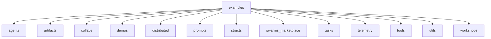

# Swarm Examples

[](https://discord.gg/agora-999382051935506503) [](https://www.youtube.com/@kyegomez3242) [](https://www.linkedin.com/in/kye-g-38759a207/) [](https://x.com/kyegomezb)


The Swarms Framework is a production-grade framework designed for building and deploying multi-agent systems. It provides robust tools and libraries to facilitate the development of complex, distributed, and scalable llm-agent-based applications.

## Features

- **Scalability**: Easily scale your agent systems to handle large numbers of agents.
- **Flexibility**: Supports a wide range of agent architectures and communication protocols.
- **Integration**: Seamlessly integrates with existing systems and technologies.
- **Performance**: Optimized for high performance and low latency.

## Getting Started

### Prerequisites

```bash
$ pip3 install -U swarms swarm-models swarms-memory

```

### Installation

Clone the repository and install the dependencies:

```bash
git clone https://github.com/The-Swarm-Corporation/swarms-examples
cd swarm-framework
pip install -r requirements.txt
```

## Examples

The `examples` directory contains various subdirectories, each focusing on different aspects of the Swarm Framework. Below is an overview of the available examples and their related tools:

- **agents**: Contains examples demonstrating the creation and management of individual agents within a swarm. These examples highlight the use of the `Agent` class and its capabilities.
  
- **artifacts**: Focuses on the management and utilization of artifacts within a swarm, showcasing how agents can interact with and leverage these resources.

- **collabs**: Provides examples of collaborative scenarios where multiple agents work together to achieve a common goal, emphasizing inter-agent communication and coordination.

- **demos**: Includes demonstration scripts that showcase the Swarm Framework's capabilities in real-world scenarios, providing a practical understanding of its applications.

- **distributed**: Contains examples related to distributed systems and how the Swarm Framework can be used to manage and orchestrate distributed agents across different nodes.

- **prompts**: Focuses on the use of prompts within the framework, demonstrating how agents can be guided and controlled through specific instructions.

- **structs**: Provides examples of different structural components within the framework, such as swarms and networks, and how they can be utilized to build complex systems.

- **swarms_marketplace**: Showcases examples related to the marketplace of swarms, where different swarms can be deployed and managed.

- **tasks**: Contains examples of task management within a swarm, demonstrating how tasks can be assigned, executed, and monitored by agents.

- **telemetry**: Focuses on the collection and analysis of telemetry data from agents, providing insights into their performance and behavior.

- **tools**: Provides examples of various tools available within the framework that agents can use to enhance their functionality.

- **utils**: Contains utility scripts and functions that support the main examples, providing additional functionality and support.

- **workshops**: Includes workshop materials and examples designed to teach users how to effectively use the Swarm Framework in different scenarios.

### Directory Structure


## Documentation

Comprehensive documentation is available [here](https://docs.swarms.world).

## Contributing

We welcome contributions! Please see our [contributing guidelines](CONTRIBUTING.md) for more details.

## License

This project is licensed under the MIT License - see the [LICENSE](LICENSE) file for details.

## Contact

For questions or support, please join our [Discord server](https://discord.gg/agora-999382051935506503) or reach out via [LinkedIn](https://www.linkedin.com/in/kye-g-38759a207/).